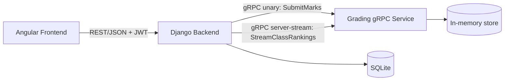

# School ERP

A minimal, demo-ready School ERP system built with Django, Angular, and a gRPC microservice. This project was developed as a scoped MVP in a 3-day Agile/Kanban cycle.

## Architecture



*Note: Angular does not communicate with gRPC directly. Django acts as the REST front door for the UI and speaks gRPC to the grading service as an internal, service-to-service call. This demonstrates the standard microservice use case for gRPC.*

## Tech Stack
- **Frontend:** Angular 22 (Standalone Components), Tailwind CSS
- **Backend:** Django, Django REST Framework, SimpleJWT
- **Microservice:** Python gRPC
- **Database:** SQLite (for Django), In-Memory Store (for gRPC analytics)
- **Deployment:** Docker, Docker Compose

## Scope / Roadmap
This project is a deliberately scoped slice of a full ERP system:

**INCLUDED**
- 2 roles: Teacher, Student
- JWT login for both roles
- Teacher: View roster, mark attendance, enter marks
- Student: View own attendance, view own marks + live class ranking
- Django ⟷ gRPC integration (for marks and class rankings analytics)
- Dockerized setup (run with a single command)

**OUT OF SCOPE (cut on purpose for this MVP)**
- Management and Super Admin portals
- Complex approval workflows (record correction, locking)
- Homework, Notice Board, Fee management, Exam schedule
- PDF report generation

## Setup Instructions

Prerequisites:
- [Docker Desktop](https://www.docker.com/products/docker-desktop/) installed and running.
- Git.

1. **Clone the repository:**
   ```bash
   git clone https://github.com/AnveshCheela/School-ERP.git
   cd School-ERP
   ```

2. **Start the application with Docker Compose:**
   ```bash
   docker-compose up --build
   ```
   This will spin up three containers:
   - `grading-service` (port 50051 internally)
   - `backend` (Django on http://localhost:8000)
   - `frontend` (Angular on http://localhost:4200)

3. **Access the application:**
   Open your browser and navigate to [http://localhost:4200](http://localhost:4200).

### Test Credentials
The backend automatically populates seed data on startup. You can test the application using these accounts:

**Teacher Accounts:**
- Username: `teacher1` | Password: `teacher123`
- Username: `teacher2` | Password: `teacher123`

**Student Accounts:**
- Username: `student1` | Password: `student123`
- (up to `student5`)

## Known Limitations
- The grading service uses an in-memory store for this demo scope. Restarting the `grading-service` container will reset the rankings data. (Note: The Django SQLite database is the source of truth for the raw marks, while the gRPC service is a stateless analytics layer).
- Default SQLite database is used for the Django backend instead of PostgreSQL to keep the local setup simple.
