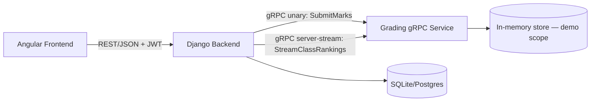

# School ERP — Scoped MVP Implementation Plan
**Stack:** Django (backend) · Angular (frontend) · gRPC (grading microservice) · Agile/Kanban
**Timeline:** 3 days · 2 people
**Goal:** A working, demo-able, resume-ready repo — not the full spec, a deliberately scoped slice of it.

---

## 0. Scope — what's IN and OUT

This is the single most important section. State this explicitly in your README too, so the cut scope reads as a decision, not a shortfall.

**IN**
- 2 roles: Teacher, Student
- JWT login for both roles
- Teacher: mark attendance, enter marks
- Student: view own attendance, view own marks + live class ranking
- Django ⟷ gRPC microservice integration (marks analytics)
- Dockerized, docker-compose up and it runs
- Kanban board + daily iteration, real commit history

**OUT (cut from the original spec, on purpose)**
- Management and Super Admin portals
- All 5 approval workflows (record correction, locking)
- Homework, Notice Board, Fee management, Exam schedule
- PDF report generation
- Public landing page, per-module search, audit log UI
- Polished "modern dashboard" (sidebar nav, pagination, toasts, cards) — functional UI only

---

## 1. Architecture



**Why this shape, in one sentence for your README/interview:** Angular never talks gRPC directly (browsers can't, without a grpc-web proxy) — Django is the REST front door for the UI, and speaks gRPC to the grading service as an internal, service-to-service call. That's the textbook reason gRPC exists, not a forced-in gap-filler.

**Known limitation to state honestly in the README:** the grading service's store is in-memory for this scope — restarting it loses ranking data. Django's DB is the source of truth for raw marks/attendance; the grading service is a stateless-on-restart analytics layer. Naming this yourself in the README reads as engineering judgment, not an oversight.

---

## 2. Repo structure

```
school-erp/
├── docker-compose.yml
├── README.md
├── backend/                  # Django
│   ├── manage.py
│   ├── erp/                  # project settings
│   ├── accounts/             # User, role-based auth
│   ├── academics/            # Student, Teacher, Attendance, Marks
│   ├── grpc_client/          # wraps calls to grading-service
│   └── requirements.txt
├── grading-service/           # already built — gRPC microservice
│   ├── grading.proto
│   ├── server.py
│   ├── grading_pb2.py / grading_pb2_grpc.py
│   └── requirements.txt
└── frontend/                 # Angular
    └── src/app/
        ├── core/
        │   ├── services/auth.service.ts
        │   ├── interceptors/auth.interceptor.ts
        │   └── guards/role.guard.ts
        └── features/
            ├── login/
            ├── teacher-dashboard/
            │   ├── attendance-form/
            │   ├── marks-form/
            │   └── student-list/
            └── student-dashboard/
                ├── attendance-view/
                └── marks-view/
```

---

## 3. Django backend

### 3.1 Models (`accounts/models.py`, `academics/models.py`)

```python
# accounts/models.py
from django.contrib.auth.models import AbstractUser
from django.db import models

class User(AbstractUser):
    class Role(models.TextChoices):
        TEACHER = "teacher", "Teacher"
        STUDENT = "student", "Student"
    role = models.CharField(max_length=10, choices=Role.choices)


# academics/models.py
from django.db import models
from accounts.models import User

class SchoolClass(models.Model):
    name = models.CharField(max_length=20)  # e.g. "10A"

class Student(models.Model):
    user = models.OneToOneField(User, on_delete=models.CASCADE)
    student_id = models.CharField(max_length=20, unique=True)
    school_class = models.ForeignKey(SchoolClass, on_delete=models.CASCADE)

class Teacher(models.Model):
    user = models.OneToOneField(User, on_delete=models.CASCADE)
    teacher_id = models.CharField(max_length=20, unique=True)

class Attendance(models.Model):
    student = models.ForeignKey(Student, on_delete=models.CASCADE)
    date = models.DateField()
    present = models.BooleanField(default=True)
    marked_by = models.ForeignKey(Teacher, on_delete=models.SET_NULL, null=True)

class Marks(models.Model):
    student = models.ForeignKey(Student, on_delete=models.CASCADE)
    subject = models.CharField(max_length=50)
    score = models.FloatField()
    submitted_by = models.ForeignKey(Teacher, on_delete=models.SET_NULL, null=True)
    created_at = models.DateTimeField(auto_now_add=True)
```

### 3.2 Auth
- `djangorestframework-simplejwt` for JWT (`/api/auth/login/`, `/api/auth/refresh/`)
- `IsAuthenticated` + a small custom permission class checking `request.user.role` for teacher-only write endpoints

### 3.3 gRPC client wrapper (`grpc_client/client.py`)

```python
import grpc
import grading_pb2, grading_pb2_grpc

CHANNEL = grpc.insecure_channel("grading-service:50051")  # docker-compose service name
STUB = grading_pb2_grpc.GradingServiceStub(CHANNEL)

def submit_marks(student_id, student_name, class_id, subject, score):
    return STUB.SubmitMarks(grading_pb2.MarksRequest(
        student_id=student_id, student_name=student_name,
        class_id=class_id, subject=subject, score=score,
    ))

def get_class_rankings(class_id):
    return list(STUB.StreamClassRankings(grading_pb2.ClassRequest(class_id=class_id)))
```

### 3.4 Key endpoints

| Method | URL | Role | Does |
|---|---|---|---|
| POST | `/api/auth/login/` | any | JWT login |
| GET | `/api/profile/` | any | role-aware profile |
| GET | `/api/teacher/students/` | teacher | list class students |
| POST | `/api/teacher/attendance/` | teacher | mark attendance |
| POST | `/api/teacher/marks/` | teacher | save Marks row + call `submit_marks()` → return average |
| GET | `/api/class/<class_id>/rankings/` | both | call `get_class_rankings()` → return JSON list |
| GET | `/api/student/attendance/` | student | own attendance only |

---

## 4. Angular frontend

- `ng new frontend --routing --style=scss`, then `ng add @angular/material` (fast, styled components — you won't have time to hand-roll CSS)
- Use **standalone components** (Angular 17+) — less NgModule boilerplate, faster to learn from zero
- `AuthService`: login(), stores JWT in memory/localStorage, `isTeacher()/isStudent()`
- `authInterceptor`: attaches `Authorization: Bearer <token>` to every request
- `roleGuard`: blocks `/teacher/*` routes from students and vice versa

**Component list (minimum):**
- `LoginComponent` — form → `AuthService.login()` → redirect by role
- `AttendanceFormComponent` (teacher) — select student, mark present/absent
- `MarksFormComponent` (teacher) — select student, subject, score → shows returned average
- `StudentListComponent` (teacher) — table of their class
- `AttendanceViewComponent` (student) — their own attendance table
- `MarksViewComponent` (student) — their average + class ranking table (Angular Material `mat-table`)

---

## 5. gRPC grading service

Already built and verified working (unary `SubmitMarks` + streaming `StreamClassRankings`). Drop the files you already have into `grading-service/`. No changes needed unless you want to add fields.

---

## 6. docker-compose.yml (skeleton)

```yaml
services:
  grading-service:
    build: ./grading-service
    ports: ["50051:50051"]

  backend:
    build: ./backend
    ports: ["8000:8000"]
    depends_on: [grading-service]
    environment:
      - GRPC_HOST=grading-service:50051

  frontend:
    build: ./frontend
    ports: ["4200:4200"]
    depends_on: [backend]
```

---

## 7. Day-by-day plan

**Day 1**
- [ ] Repo created, GitHub Projects board set up (Backlog / In Progress / Review / Done)
- [ ] Write issues as user stories (see §8)
- [ ] *You:* Django models + migrations, JWT auth wired, grading-service confirmed running
- [ ] *Friend:* `ng new`, routing skeleton, Angular Material added, `AuthService` shell

**Day 2**
- [ ] *You:* All DRF endpoints (§3.4), gRPC client wired into marks/rankings views, permissions enforced
- [ ] *Friend:* Login form functional against real API, teacher forms, student views built and calling real endpoints
- [ ] End-to-end test: login → mark attendance → submit marks → see ranking, both roles

**Day 3**
- [ ] docker-compose up works from a clean clone
- [ ] Seed data script/fixture (a few students, teachers, sample marks) so the demo isn't empty
- [ ] README written (§9)
- [ ] Screenshots/demo GIF captured
- [ ] Final commits, board moved to Done, close out issues

---

## 8. Sample Kanban issues (write these as actual GitHub issues)

- "As a teacher, I want to log in and see my class roster"
- "As a teacher, I want to mark attendance for a student on a given date"
- "As a teacher, I want to submit a mark and immediately see the updated average"
- "As a student, I want to view my own attendance history"
- "As a student, I want to see my current class ranking"
- "As the system, marks submission should call the grading gRPC service, not compute locally"
- "Set up docker-compose so all three services run with one command"

Close each with a one-line note on what you actually did — that's your commit-adjacent paper trail for "yes, I really built this."

---

## 9. README outline

1. One-line project description
2. Architecture diagram (reuse the mermaid diagram above)
3. Tech stack
4. **Scope / Roadmap** — explicitly list what's built vs. the full original ERP spec (link back to §0)
5. Setup instructions — must work verbatim on a clean clone; test this yourself before it goes on your resume
6. Screenshots / demo GIF
7. Known limitations (in-memory grading store, etc.)

---

## 10. Pre-resume checklist

- [ ] `docker-compose up` works from a fresh clone on a machine that isn't yours
- [ ] Can actually log in and complete the teacher → student flow live
- [ ] Commit history shows real incremental work, not one giant commit
- [ ] README setup steps verified to work as written
- [ ] No secrets/`.env` committed — `.env.example` instead
- [ ] You can personally explain every line of the gRPC integration in an interview

---

## 11. Draft resume bullet (finalize once built)

> *Architected a School ERP MVP with a Django REST backend and Angular frontend, integrating a standalone Python gRPC microservice for grade analytics — including a server-streaming RPC for live class rankings; scoped and delivered across a 3-day Agile/Kanban cycle with a co-developer.*
